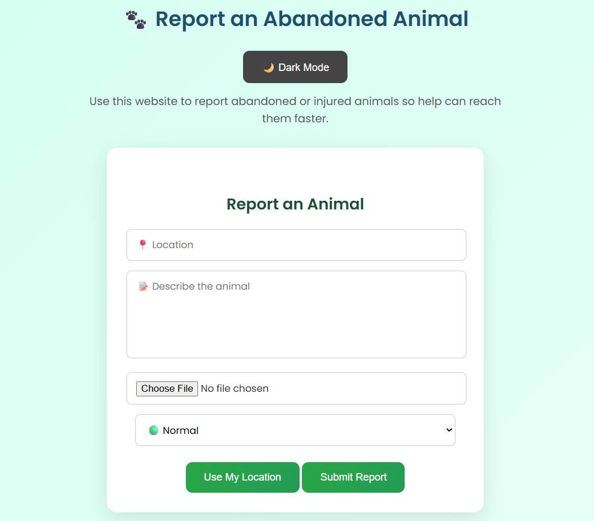
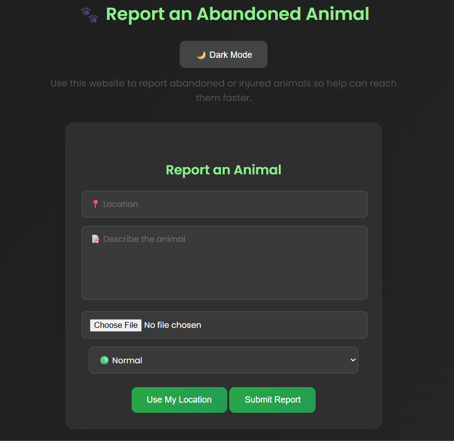
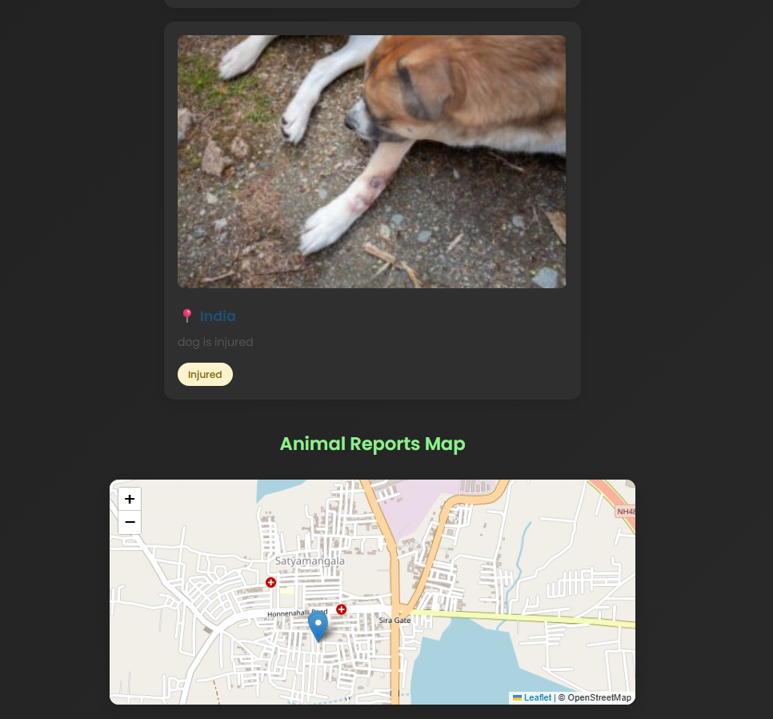

# 🐾 Urban Stray Watch

A simple frontend web application that allows users to report abandoned or stray animals in their area.

This project helps create awareness and provides a simple way for people to submit animal rescue reports.

---

## 🚀 Features

- 📍 Report abandoned animals
- 📝 Submit location and description details
- 📷 Upload animal image
- 💾 Data stored using LocalStorage
- 🎨 Clean and simple user interface

---

## 🛠 Tech Stack

- HTML5
- CSS3
- JavaScript
- LocalStorage (Browser Storage)

---

## 📷 Screenshots

### 🏠 Home Page

### 📝 Reported Animal

---

## 💡 How It Works

1. User fills in the animal report form.
2. Image and details are submitted.
3. Data is stored in browser LocalStorage.
4. Reports can be viewed instantly on the page.

---

## 📌 Future Improvements

- Backend integration (Node.js / Express)
- Database storage (MongoDB)
- Authentication system
- Admin dashboard
- Real-time location tracking

---

## 👩‍💻 Author

**Deeksha Mohan**

Frontend Developer | Data & AI Enthusiast
